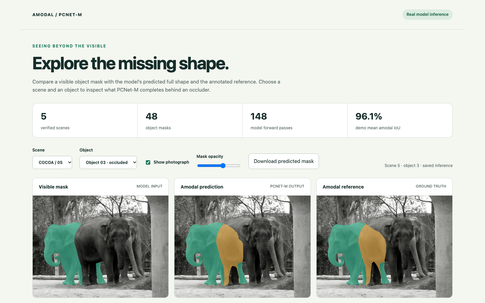
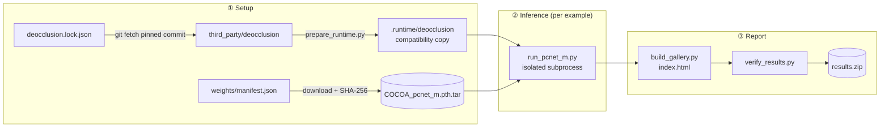
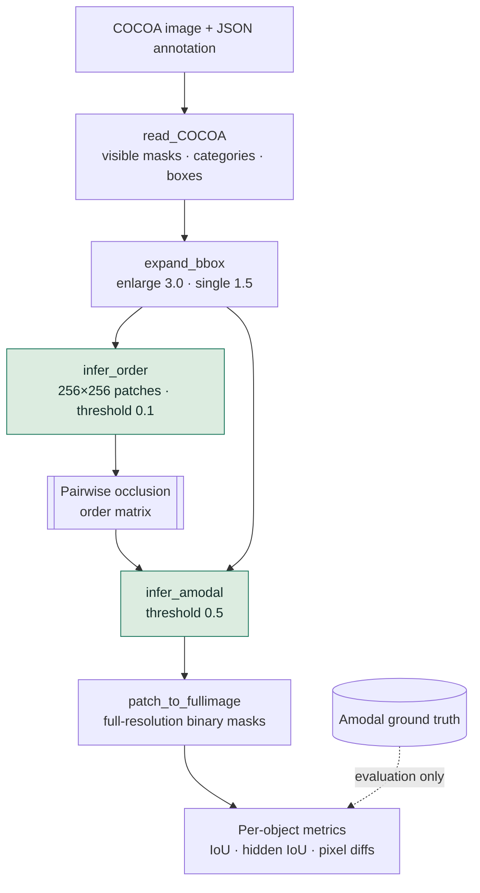
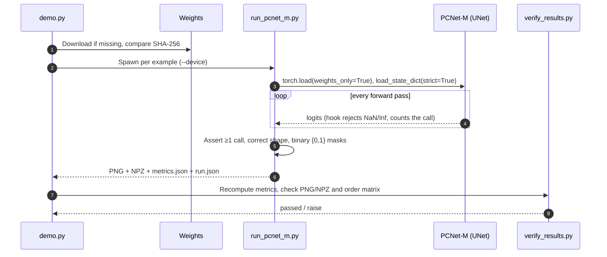
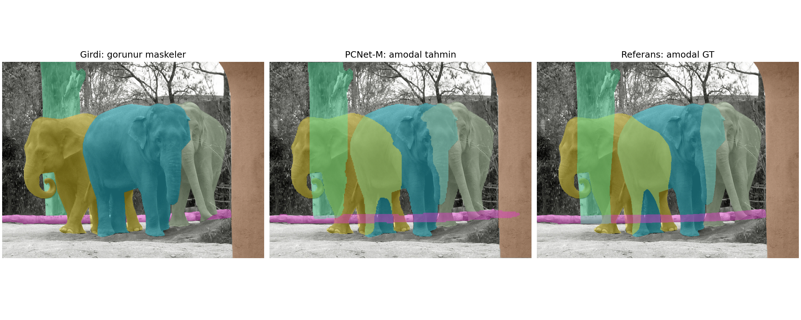
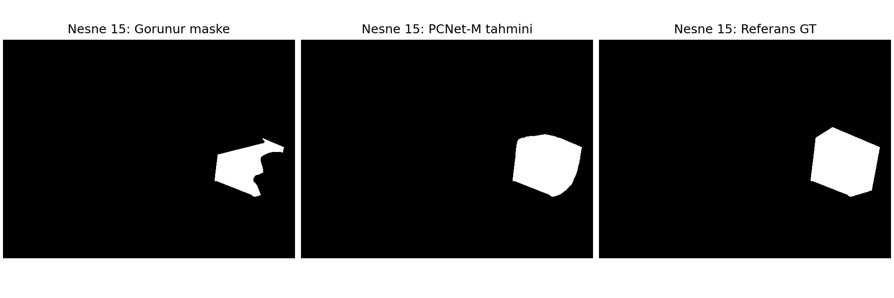
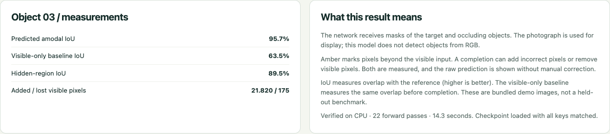
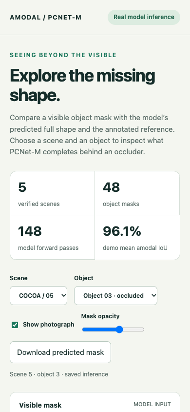
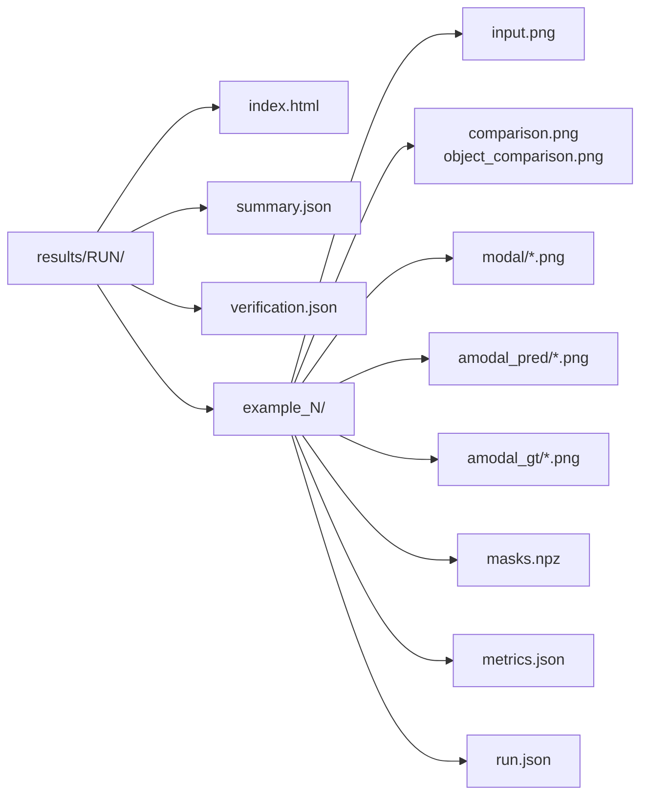

<div align="center">

# Amodal Mask Completion · PCNet-M

**See the whole object, even where it is hidden.**
Reproducible inference for completing partially occluded object masks with the official PCNet-M COCOA checkpoint.

[](https://www.python.org/)
[](https://pytorch.org/)
[](LICENSE)
[](docs/results/verification.json)
[](reports/colab-validation.json)
[](docs/results/summary.json)
[](https://colab.research.google.com/drive/1linAtHf5f0WAKvW47AJtzjBfc03RulmI)



<sub>The bundled offline viewer: visible input → PCNet-M completion (amber) → annotated reference.</sub>

[Quick start](#-quick-start) · [How it works](#-how-it-works) · [Results](#-results) · [Viewer](#-results-viewer-uiux) · [Outputs](#-output-format) · [Verification](#-verification) · [Colab](#-google-colab-gpu) · [Provenance](#-implementation-and-provenance)

</div>

---

## ✨ Highlights

| | Feature | Details |
|:-:|---|---|
| 🧠 | **Real model inference** | Official PCNet-M UNet and inference logic, 3,352,002 parameters, unmodified architecture |
| 🔒 | **Integrity checks** | Checkpoint SHA-256, `weights_only=True`, `strict=True` state loading, NaN/Inf logit guard |
| 📌 | **Pinned & reproducible** | Upstream source pinned to an exact commit; dependencies locked; seed 0 |
| 💻 | **CPU first, CUDA optional** | Full run on a laptop CPU; `--device cuda` for NVIDIA GPUs; Colab T4 verified |
| 🖼️ | **Offline interactive viewer** | One self-contained HTML file. No server, no install, works on mobile |
| ✅ | **Independent verification** | Masks, PNG/NPZ agreement, occlusion order and recomputed metrics are checked after each run |

> [!IMPORTANT]
> The network takes **visible object masks** as input, not a raw photograph. It does not detect objects. RGB is used only for visualization, and ground-truth amodal masks are used only for evaluation and display.

---

## 🚀 Quick start

**Requirements:** Python **3.12**, Git, curl. The lock file records the tested macOS arm64 environment.

```bash
python3.12 -m venv .venv-inference
source .venv-inference/bin/activate
python -m pip install --only-binary=:all: -r requirements-inference.lock.txt
python scripts/demo.py --device cpu
```

> [!TIP]
> **On Linux**, install the CPU build of PyTorch first to avoid downloading CUDA libraries:
> `python -m pip install torch==2.11.0 --index-url https://download.pytorch.org/whl/cpu`

The runner fetches the pinned upstream source and the 26.9 MB checkpoint if missing, verifies the SHA-256, builds the compatibility runtime and runs all five examples. It then prints the path to `results/<run>/index.html`. Open that file in a browser.

### CLI reference

```bash
python scripts/demo.py [--example {all,1,2,3,4,5}] [--device {auto,cpu,cuda}] [--output DIR]
```

| Flag | Default | Description |
|---|---|---|
| `--example` | `all` | Run one bundled COCOA example or all five |
| `--device` | `auto` | `auto` selects CUDA when available, otherwise CPU. Apple MPS is not used |
| `--output` | `results/<UTC-timestamp>_<id>` | Must be empty. Existing runs are never overwritten |

```bash
# Single example in a fixed directory, then verify it
python scripts/demo.py --example 4 --device cpu --output results/my-run
python scripts/verify_results.py results/my-run --expected-examples 1
```

A failed run keeps its error report. Use a new output directory when retrying.

---

## 🧩 How it works

### End-to-end pipeline (`scripts/demo.py`)



### Inference inside `run_pcnet_m.py`

PCNet-M runs in two stages: it first estimates which object is in front, then completes each object using its occluders.



### Safety checks during a run



---

## 📊 Results

**Verified on 30 September 2026:** all 5 examples completed on CPU, with **48 object masks** and **148 real model forward passes**.

| Measurement | Result |
|---|---:|
| Mean predicted amodal IoU | **96.05%** |
| Mean visible-only baseline IoU | 85.76% |
| Improvement over baseline | **+10.29 pp** |
| Pixels added by completion | 168,501 |
| Visible pixels removed by raw predictions | 3,138 |

### Per scene

| Scene | Objects | Forward passes | Amodal IoU | Visible baseline | Δ | Added px | Lost visible px | CPU time |
|:-:|:-:|:-:|---:|---:|---:|---:|---:|---:|
| [1](docs/results/example_1) | 2 | 4 | 97.89% | 83.16% | +14.73 | 28,316 | 591 | 52.7 s |
| [2](docs/results/example_2) | 11 | 31 | 98.61% | 88.40% | +10.21 | 33,790 | 423 | 15.6 s |
| [3](docs/results/example_3) | 19 | 65 | 97.90% | 88.47% | +9.43 | 29,544 | 568 | 18.9 s |
| [4](docs/results/example_4) | 10 | 26 | 90.54% | 86.41% | +4.13 | 18,354 | 248 | 15.1 s |
| [5](docs/results/example_5) | 6 | 22 | 94.10% | 72.12% | +21.98 | 58,497 | 1,308 | 14.3 s |

<sub>Scene means weight each object equally. CPU time is the wall-clock time per example recorded in `run.json`. 10 of the 48 objects score below their visible-only baseline. Nine of these have no annotated hidden region, so their visible mask already matches the reference and any edge erosion lowers the score.</sub>

> [!NOTE]
> These are descriptive scores on five bundled demo images, **not a held-out benchmark**. No manual correction, extra union with the input mask, training or fine-tuning is applied.

### Gallery

<table>
<tr>
<td colspan="2"></td>
</tr>
<tr>
<td colspan="2" align="center"><sub><b>Scene 5:</b> visible input masks · PCNet-M amodal prediction · amodal reference</sub></td>
</tr>
<tr>
<td width="50%"></td>
<td width="50%"></td>
</tr>
<tr>
<td align="center"><sub>Scene 1 · single occluded object</sub></td>
<td align="center"><sub>Scene 3 · single occluded object</sub></td>
</tr>
</table>

---

## 🖥️ Results viewer (UI/UX)

**[Open the saved viewer → `docs/results/index.html`](docs/results/index.html)**

GitHub shows the HTML source, so clone or download the repository and open the file in a browser. Each new run generates its own `results/<run>/index.html`.

<table>
<tr>
<td width="68%"></td>
<td width="32%" rowspan="2"></td>
</tr>
<tr>
<td valign="top">

| Control | What it does |
|---|---|
| **Scene** | Switch between the five COCOA scenes |
| **Object** | Pick an object. Occluded ones are labelled |
| **Show photograph** | Toggle the RGB backdrop under the masks |
| **Mask opacity** | Blend masks from 10% to 100% |
| **Download** | Save the selected predicted mask as PNG |
| **Object table** | Every object's IoU and pixel deltas, one click to inspect |

</td>
</tr>
</table>

### Design decisions

| Principle | Implementation |
|---|---|
| **Aligned comparison** | Three synchronized canvases: *Model input* · *PCNet-M output* · *Ground truth* |
| **Show the change** | Teal shows visible pixels, amber shows pixels the model added beyond the visible input |
| **Honest metrics** | Visible baseline, hidden-region IoU and *lost visible pixels* are shown next to the headline IoU |
| **Plain-language context** | A "What this result means" panel explains inputs, colors and limits |
| **Fully offline** | Results are embedded as JSON in one HTML file. No network calls, no model in the browser |
| **Responsive** | Under 750 px wide, the 4-column stats become 2 columns and the panels stack |
| **Accessible** | Labelled controls and canvases (`aria-label`), `role="status"` and `role="alert"` regions, visible `:focus-visible` rings |

---

## 📁 Output format



| File | Contents |
|---|---|
| `input.png` | Official example photograph |
| `comparison.png` | Overlay comparison of all objects |
| `object_comparison.png` | Binary masks for one occluded object |
| `modal/*.png` | Visible input masks, values 0/255 |
| `amodal_pred/*.png` | Raw model completions, values 0/255 |
| `amodal_gt/*.png` | Reference masks, values 0/255 |
| `masks.npz` | Binary masks, bounding boxes, categories, occlusion order |
| `metrics.json` | Per-object IoU and completion diagnostics |
| `run.json` | Status, checkpoint hash, device, forward-call count, timing, environment, source hashes |

**`masks.npz` arrays:** masks have shape `(objects, height, width)` with values 0/1. An `order_matrix[i, j]` of `-1` means object *i* is **behind** object *j*.

```python
import numpy as np
data = np.load("docs/results/example_1/masks.npz")
print({k: data[k].shape for k in data.files})
```

### Metrics

| Metric | Definition | Notes |
|---|---|---|
| Amodal IoU | \|pred ∩ gt\| / \|pred ∪ gt\| | Headline score |
| Visible baseline IoU | \|visible ∩ gt\| / \|visible ∪ gt\| | Score without any completion |
| Hidden-region IoU | IoU of *added* pixels against *annotated hidden* pixels | `null` when no hidden region is annotated |
| Added pixels | \|pred \ visible\| | Completion volume |
| Lost visible pixels | \|visible \ pred\| | Erosion error |

Example from `metrics.json` (scene 1, occluded object):

```json
{
  "instance": 1,
  "visible_pixels": 59784,
  "predicted_pixels": 87513,
  "hidden_gt_pixels": 30354,
  "added_pixels": 27951,
  "lost_visible_pixels": 222,
  "amodal_iou": 0.9649,
  "visible_baseline_iou": 0.6632,
  "hidden_iou": 0.9037
}
```

---

## ✅ Verification

```bash
python -m pip check
python scripts/validate_project.py
python scripts/verify_results.py results/my-run --expected-examples 1
```

| Script | Checks |
|---|---|
| `validate_project.py` | Notebook schema and embedded code · exact source commit · checkpoint integrity · rejection of invalid weights · allowed source adaptations |
| `verify_results.py` | Successful model execution · binary values and shapes · PNG/NPZ equality · occlusion-matrix consistency · checkpoint provenance · independently recomputed metrics |

Run the demo first so the source and weights are available.

**CI:** an optional GitHub Actions workflow is in [`ci/github-actions.yml`](ci/github-actions.yml). Copy it to `.github/workflows/check.yml` to run CPU inference on example 4, validate and upload the results as an artifact on every push and PR.

---

## ☁️ Google Colab (GPU)

[](https://colab.research.google.com/drive/1linAtHf5f0WAKvW47AJtzjBfc03RulmI)

1. Upload [`notebooks/01_pcnet_m_colab.ipynb`](notebooks/01_pcnet_m_colab.ipynb) to Colab (it is self-contained).
2. Select a free **T4** runtime with Python 3.12 / PyTorch 2.11.0.
3. Run the eight numbered cells. The notebook checks the environment first and exports a results ZIP, or a diagnostic ZIP if it fails.

| Colab verification · 1 October 2026 | |
|---|---|
| GPU | Tesla T4 (free tier) |
| Runtime | 2026.07 · Python 3.12.13 · PyTorch 2.11.0+cu128 · CUDA 12.8 |
| Workload | Example 4 · 10 objects · 26 forward passes · 18.0 s |
| Mean amodal IoU | 90.54% (matches the CPU run) |
| Independent local verification | ✅ passed ([report](reports/colab-validation.json)) |

This verifies one demo example on GPU. The five-example CPU run is a separate result. No paid compute was used.

After editing the notebook's embedded helpers, rebuild it:

```bash
python scripts/build_notebook.py && python scripts/validate_project.py
```

---

## 🔍 Implementation and provenance

| Item | Value |
|---|---|
| Upstream source | [XiaohangZhan/deocclusion](https://github.com/XiaohangZhan/deocclusion) @ `ac543f9a54f4cb8baf0774bdb5f8638eadf8b57c` |
| Checkpoint | `COCOA_pcnet_m.pth.tar` · 26,870,559 bytes · training step 56,000 |
| SHA-256 | `3740e8f709f824068dd36be46bd44ffd18105c4f606c099789c93f3ae4b860f7`¹ |
| Loading | `weights_only=True`, exact keys/shapes with `strict=True`, rejects non-finite weights or logits |
| Inference settings | 256×256 patches · order threshold 0.1 · amodal threshold 0.5 · seed 0 |
| Source adaptations | 6 × `np.int` and 2 × `np.bool` aliases replaced · 8 CUDA tensor placements follow the model device |
| Untouched | UNet architecture, inference logic, `read_COCOA`, `expand_bbox`; the upstream checkout is never edited; no global monkey-patching |

<sub>¹ Computed from the original download, not a publisher signature.</sub>

### Project layout

```text
scripts/
├── demo.py                 Reproduce the complete demo (entry point)
├── run_pcnet_m.py          Verified weight loading and inference
├── prepare_runtime.py      Narrow upstream compatibility adapter
├── download_weights.py     Checkpoint download + SHA-256 check
├── build_gallery.py        Export the offline interactive viewer
├── verify_results.py       Verify saved predictions and measurements
├── build_notebook.py       Build the self-contained Colab notebook
└── validate_project.py     Validate code, notebook, weights and provenance
web/viewer.html             Offline viewer template
weights/manifest.json       Checkpoint source and checksum
third_party/deocclusion.lock.json   Pinned official source
notebooks/                  Colab notebook
docs/results/               Saved verified run + viewer
docs/assets/                README screenshots
reports/                    Validation evidence and setup notes
ci/github-actions.yml       Optional CI workflow
```

Model weights, virtual environments, downloaded source, caches and new runs are excluded from Git.

---

## 📜 License

Software: [Apache-2.0](LICENSE). See [NOTICE](NOTICE) for attribution and third-party data/weight terms.

---

<details>
<summary>🇹🇷 <b>Türkçe özet</b></summary>

Tüm örnekleri çalıştırmak için `python scripts/demo.py --device cpu` komutunu kullanın. Sonunda yazdırılan `index.html` dosyasını tarayıcıda açın. Görünür maskeler örnek anotasyonlarından gelir; sistem fotoğraftan otomatik nesne bulmaz. Referans maskeler tahmine verilmez.

</details>
