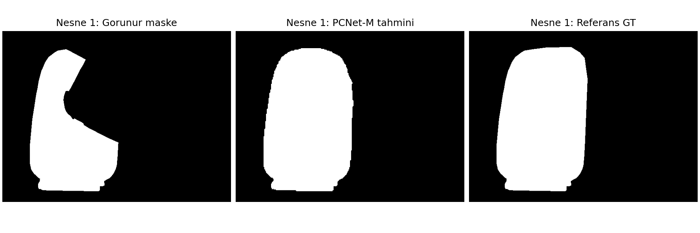

# Amodal mask completion with PCNet-M

A reproducible inference project for completing partially occluded object masks with the official **PCNet-M COCOA checkpoint**. Includes a local CPU runner, an optional CUDA/Colab notebook, per-object mask exports, and an offline interactive results viewer.

The network takes **visible object masks**, not an unannotated photograph. RGB is used for visualization. Ground-truth amodal masks are used only for evaluation and display.

## Verified results — 30 September 2026

**All 5 examples completed on CPU: 48 object masks, 148 real model forward passes.**

| Measurement | Observed result |
|---|---:|
| Mean predicted amodal IoU | 96.05% |
| Mean visible-only baseline IoU | 85.76% |
| Pixels added by completion | 168,501 |
| Visible pixels removed by the raw predictions | 3,138 |

These are descriptive scores on the five bundled demo images, not a generalization benchmark.

**[Open the saved interactive viewer](docs/results/index.html)** after cloning or downloading the repository. GitHub's file page displays HTML source; open the downloaded file in a browser. No installation is needed to explore these saved results.



[Verification evidence](docs/results/verification.json) · [Aggregate measurements](docs/results/summary.json). Raw masks and per-example run logs are also included under `docs/results/`.

## Quick start

Python **3.12**, Git, and curl are required. The lock file records the tested macOS arm64 environment. On Linux, first install `torch==2.11.0` from `https://download.pytorch.org/whl/cpu` using pip’s `--index-url` option if you want to avoid downloading CUDA libraries. Use a project-local environment:

```bash
python3.12 -m venv .venv-inference
source .venv-inference/bin/activate
python -m pip install --only-binary=:all: -r requirements-inference.lock.txt
python scripts/demo.py --device cpu
```

The runner downloads the pinned upstream source and the 26.9 MB checkpoint if missing, verifies the checkpoint's SHA-256, builds the compatibility runtime, and runs all five bundled examples. It prints the path to `results/<run>/index.html`; open that file in your browser. The viewer works offline and includes every object's prediction and reference.

For one example or a fixed output directory:

```bash
python scripts/demo.py --example 4 --device cpu --output results/my-run
python scripts/verify_results.py results/my-run --expected-examples 1
```

Output directories must be empty. A failed run retains its error report; use a new directory when retrying. CUDA is available with `--device cuda` on a compatible PyTorch/NVIDIA installation. `--device auto` selects CUDA when available, otherwise CPU. Apple MPS is not used.

## Inspecting results

The viewer provides scene and object selection, aligned visible/predicted/reference masks, photograph overlays, opacity control, per-object IoU, pixel counts, and predicted-mask PNG downloads. It displays saved inference, not browser-side model execution.

Each example exports:

| File | Meaning |
|---|---|
| `input.png` | Official example photograph |
| `comparison.png` | All-object overlay comparison |
| `object_comparison.png` | Binary masks for an occluded object |
| `modal/*.png` | Visible input masks, values 0/255 |
| `amodal_pred/*.png` | Raw model completions, values 0/255 |
| `amodal_gt/*.png` | Reference masks, values 0/255 |
| `masks.npz` | Binary masks, bounding boxes, categories, occlusion order |
| `metrics.json` | Per-object IoU and completion diagnostics |
| `run.json` | Success/failure, checkpoint hash, device, actual forward-call count, timing and environment |

In `masks.npz`, masks have shape `(objects, height, width)` and values 0/1. An order-matrix entry of `-1` means the row object is behind the column object.

IoU is intersection divided by union. The visible-only baseline compares the uncompleted mask with the same amodal reference. Hidden-region IoU compares predicted added pixels with annotated hidden pixels, and is undefined (`null`) when no hidden region is annotated. Means weight each object equally. Added and lost-visible pixel counts expose both completion and erosion errors.

These five bundled images are **demonstration examples**, not a held-out benchmark. Completion can be wrong, and some predictions may score below the visible-only baseline. No manual mask correction, extra union with the input mask, training, or fine-tuning is applied.

## Verification

```bash
python -m pip check
python scripts/validate_project.py
python scripts/verify_results.py results/my-run --expected-examples 1
```

`validate_project.py` checks the notebook schema and embedded code, exact source commit, checkpoint integrity, rejection of invalid weights, and the allowed source adaptations. Run the demo first to fetch source and weights.

`verify_results.py` checks successful model execution, binary values and shapes, PNG/NPZ agreement, occlusion-matrix consistency, checkpoint provenance, and independently recomputed metrics. An optional GitHub Actions configuration is provided in `ci/github-actions.yml`; copy it to `.github/workflows/check.yml` to enable automated CPU inference and artifact upload.

## Colab

Upload [notebooks/01_pcnet_m_colab.ipynb](notebooks/01_pcnet_m_colab.ipynb) to Google Colab, select a free T4 runtime with Python 3.12 / PyTorch 2.11.0, and run its eight numbered cells. The notebook checks the actual environment before proceeding and exports a results ZIP, or a diagnostic ZIP after failure. The notebook is self-contained; you do not need to upload the scripts separately.

**Colab GPU execution verified on 1 October 2026:** example 4 completed on a free Tesla T4 using runtime 2026.07, Python 3.12.13, PyTorch 2.11.0+cu128 and CUDA 12.8. It produced 10 object masks through 26 model forward passes. Saved masks, PNG/NPZ agreement, checkpoint provenance and recomputed metrics passed independent local verification. This verifies one bundled demo example on GPU; the five-example CPU run above is a separate result. No paid compute was provisioned.

[Executed Colab notebook](https://colab.research.google.com/drive/1linAtHf5f0WAKvW47AJtzjBfc03RulmI) · [GPU verification report](reports/colab-validation.json). The local GPU results viewer is `results/colab-t4-20261001/index.html`; that generated directory is excluded from Git.

To rebuild the notebook after editing its embedded helper files:

```bash
python scripts/build_notebook.py
python scripts/validate_project.py
```

## Implementation and provenance

- Official source: [XiaohangZhan/deocclusion](https://github.com/XiaohangZhan/deocclusion), commit `ac543f9a54f4cb8baf0774bdb5f8638eadf8b57c`.
- Checkpoint: official `COCOA_pcnet_m.pth.tar`, **26,870,559 bytes**.
- SHA-256: `3740e8f709f824068dd36be46bd44ffd18105c4f606c099789c93f3ae4b860f7` (computed from the original download, not a publisher signature).
- Checkpoint loading uses `weights_only=True`, verifies exact state keys and shapes with `strict=True`, and rejects nonfinite weights or logits.
- The official UNet architecture and inference logic are preserved. The generated copy replaces six `np.int` and two `np.bool` aliases and changes eight CUDA tensor placements to follow the model device. No global PyTorch or NumPy monkey-patching is used.
- Original helpers `read_COCOA` and `expand_bbox` are extracted without changes. The upstream checkout is never edited.
- Official inference settings: 256×256 patches, order threshold 0.1, amodal threshold 0.5, seed 0.

The root software license is [Apache-2.0](LICENSE). See [NOTICE](NOTICE) for attribution and third-party data/weight terms. Model weights, virtual environments, downloaded source, caches and transient runs are excluded from Git.

## Project layout

```text
scripts/demo.py                Reproduce the complete demo
scripts/run_pcnet_m.py         Verified weight loading and inference
scripts/prepare_runtime.py     Narrow upstream compatibility adapter
scripts/build_gallery.py       Export the offline interactive viewer
scripts/verify_results.py      Verify saved predictions and measurements
scripts/build_notebook.py      Build the self-contained Colab notebook
scripts/validate_project.py    Validate code, notebook, weights and provenance
web/viewer.html                Offline viewer template
weights/manifest.json          Checkpoint source and checksum
third_party/deocclusion.lock.json  Pinned official source
reports/                      Validation evidence and historical setup notes
```

Türkçe: Tüm örnekleri çalıştırmak için `python scripts/demo.py --device cpu` komutunu kullanın. Sonunda yazdırılan `index.html` dosyasını tarayıcıda açın. Görünür maskeler örnek anotasyonlarından gelir; sistem fotoğraftan otomatik nesne bulmaz. Referans maskeler tahmine verilmez.
